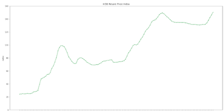
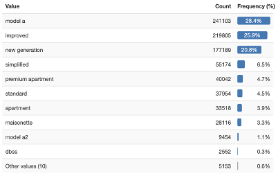
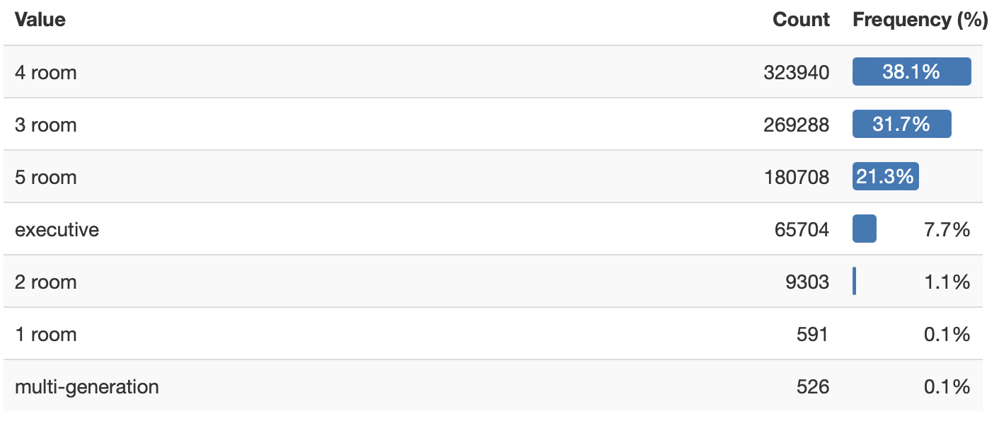
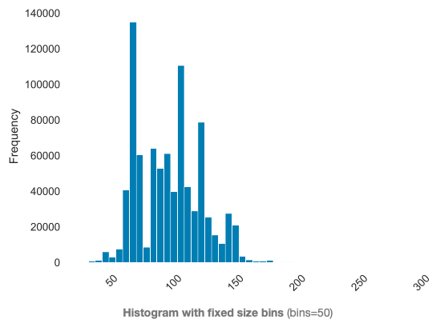
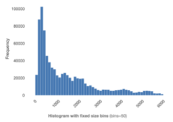
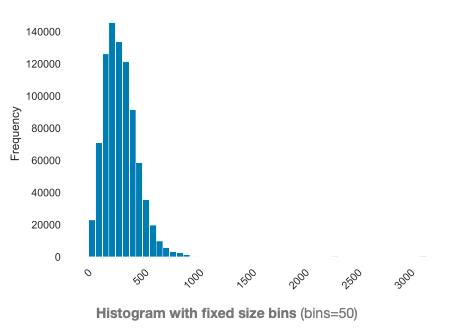
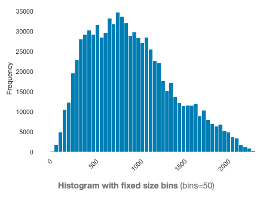
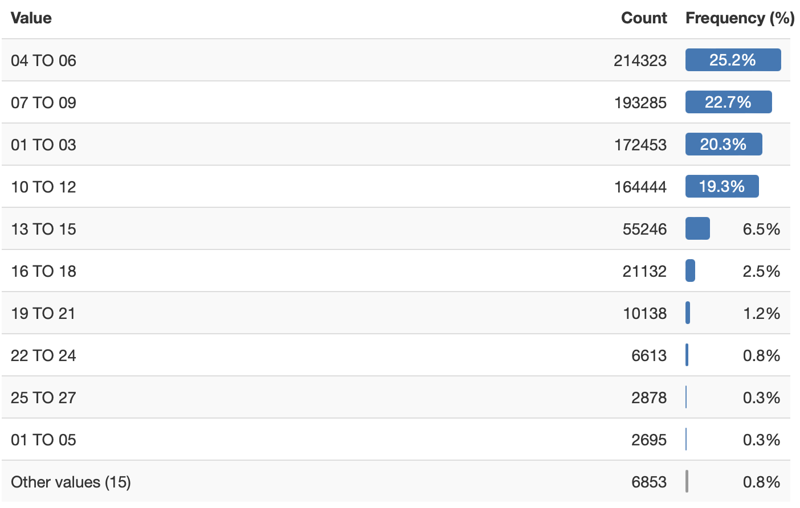
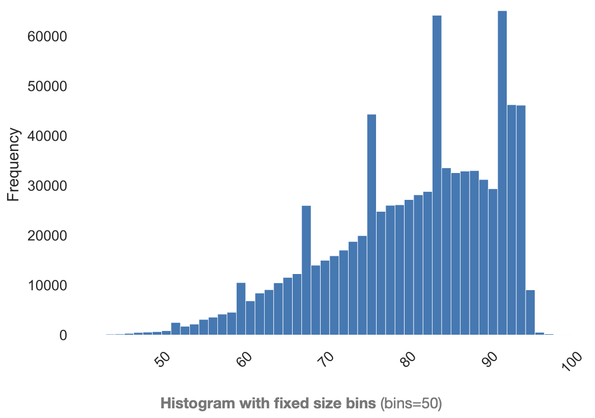
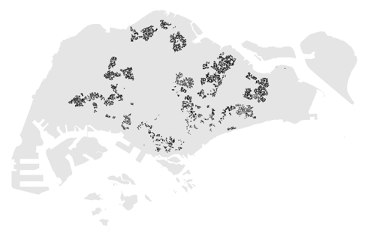

#  Project 5: HDB Resale Flat Prices

## Table of Contents
* Problem Statement
* Data Collection and Data Dictionaries
* Data Cleaning
* Exploratory Data Analysis (EDA)
* Pre-Processing and Modelling
* Evaluation and Conceptual Understanding
* Conclusion and Recommendations
* References

## Overview

Our Company aims to be a one stop solutions for buyers and sellers who are interested to buy/sell their HDB homes.

## Problem Statement

We want to predict resale flat prices by combining features of HDB flats (externally or internally). This will be useful for buyers and sellers to know what features will react positively or negatively to resale flat prices.

## Data Collection

The dataset is obtained from Data.gov.sg: 
1. HDB Property Information
2. Resale Flat Prices
3. Schools
4. MRT
5. Supermarkets
6. Hawker Centres
7. HDB Resale Price Index

## Data Cleaning

To make our application, we selected features that are important to a buyer/seller when it comes to purchasing or selling their homes. In that process, we have:

<li>Dropped miscellaneous and irrelevant columns
<li>Removed duplicates, number of resale flats in each block and perfectly correlated features
<li>Creating an ‘address’ column (combining block and road) or using postal code to find latitude and longitude
<li>HDB flats, Primary/Secondary School, Pre-school, MRT, Supermarkets, Hawker Centres, Malls/Major Attractions
<li>Finding distances between each block and the nearest feature above
<li>Created a column to identify features that lie within 1km and 5km distance from the flat
<li>Recalculated remaining lease on resale flats
<li>Dummifying categorical columns
<li>Combining all data after cleaning into one dataframe called df_dum

## Exploratory Data Analysis (EDA)

We used Matplotlib and Pandas Profiling to visualise our data.

1. Resale Price Index

2. Distribution of Flat Types

3. Distribution of Flat Models

4. Floor Square Area

5. Minimum Distance to Hawker

6. Minimum Distance to Supermarkets

7. Minimum Distance to Major Attractions

8. Storey Range

9. Remaining Lease (in years)

10. Mapping HDBs onto Singapore Map

## Pre-Processing and Modelling

We chose 6 models to perform modelling:

<li> Linear regression
<li> Lasso & LassoCV
<li> Ridge & RidgeCV
<li> ElasticNetCV
<li> Decision Tree Regression
<li> Random Forest Regression

 We first performed train, test, split, and with each model being instantiated and fitted. We also scaled our train and test dataset before the split to minimise the magnitude of the different fetures. The test scores were computed below (accuracy).

### Evaluation and Conceptual Understanding

|Model|R2 Score (Accuracy on Train)|MAE|MSE|
|---|---|---|---|
|Linear Regression|0.699|$63413|$84977|
|LassoCV|0.699|$63413|$84977|
|RidgeCV|0.699|$63413|$84977|
|ElasticNetCV|0.665|$67465|$89788|
|Decision Tree|0.999|$23685|$36178|
|Random Forest|0.993|$18738|$27500|

<li> Thoughts

Even though Decision Tree Regressor performs better than Random Forest Regressor on the training data set, it performs slightly poor on the test data set (unseen data). Hence, we decided to choose Random Forest Regressor for any future app deployment.

<li> Setbacks

Random Forest Regression is a great model to find relationships between features and create predictions. However, it is not without its faults.

It is computationally expensive, but not as expensive as neural networks (deep learning).
It performs well on large datasets, and creates averages for missing values.
When predicting values within existing dataset (intrapolation), it is able to predict with an accuracy of 96.8%
However, it does poorly on extrapolation. For example, new types of HDB flats are being built (with new features) but insufficient data is available to predict resale price.

## Conclusion and Recommendations

<b>Improvements to the Model</b>

We would like to use other Regression models, or even use stacking methods. Below are future model suggestions that we can deploy our data on:

<li>SVM
<li>Stacking Regressors
<li>Modified Versions of Random Forest (Regression-Enhanced Random Forests)

### References

Our Instructors - Shilpa and Leo, for their never ending support and industrial knowledge
Our TAs - Mark, Jun Kai and Samuel, for their skills and abilities to help us debug
DSIF3 for being amazing bunch of people and sharing knowledge too!

Specifically for this project,
Jim Meng Kok - https://www.linkedin.com/in/jimmengkok/
Teoalida.com - having better explanations on HDB types and models better than HDB itself
SlidesGo - for the wonderful slides
